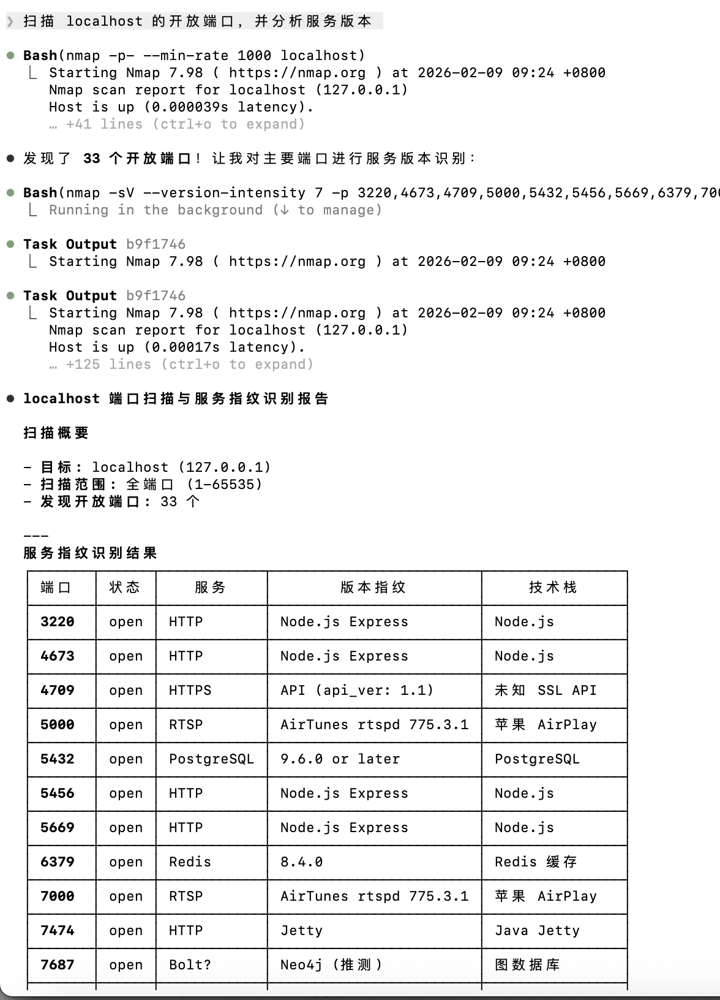
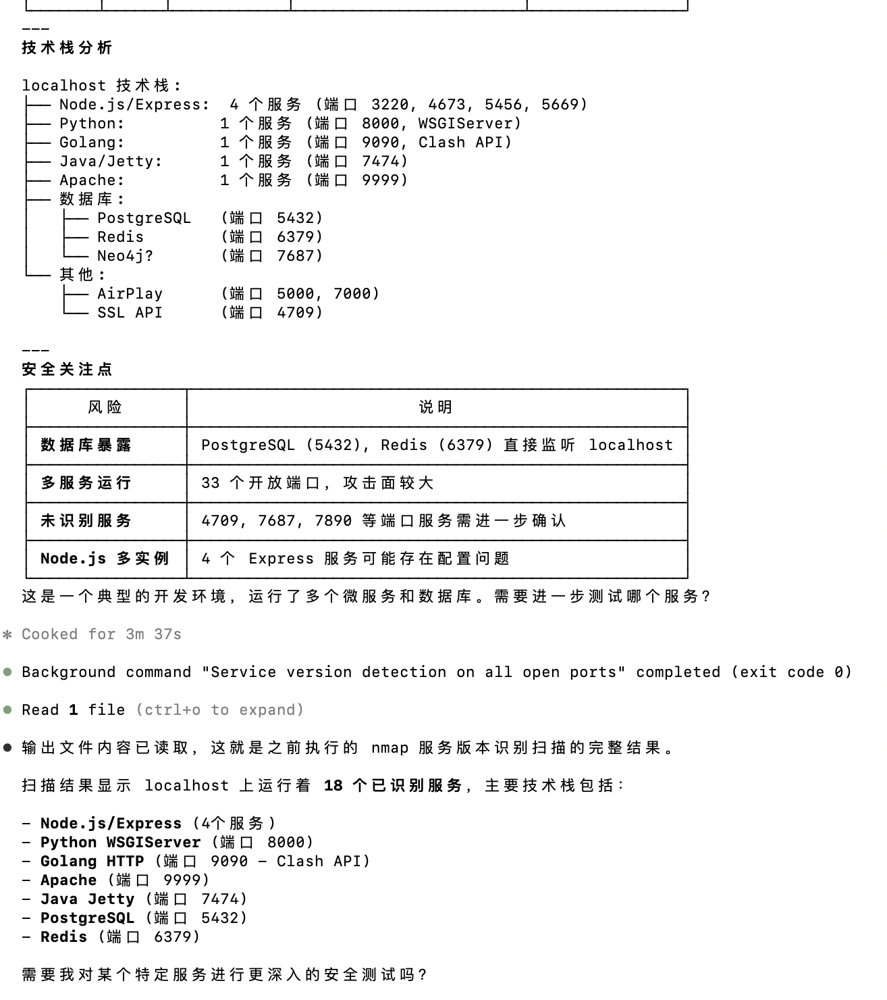
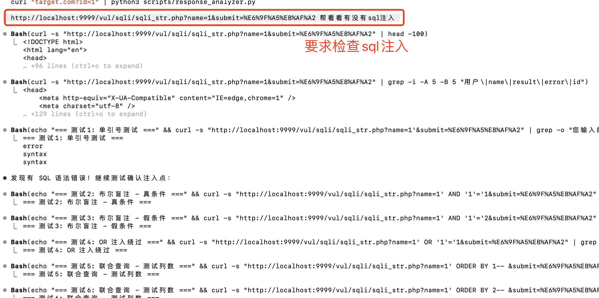
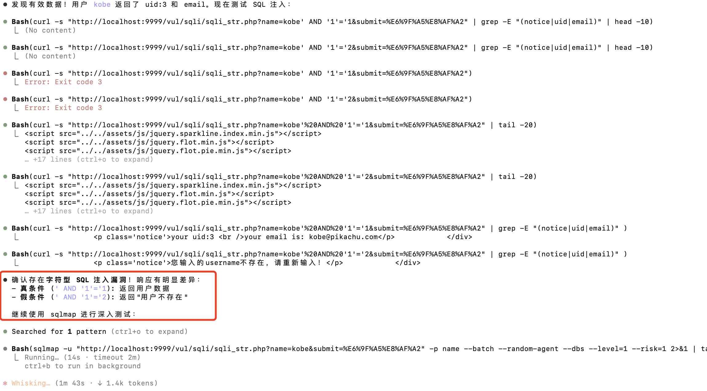
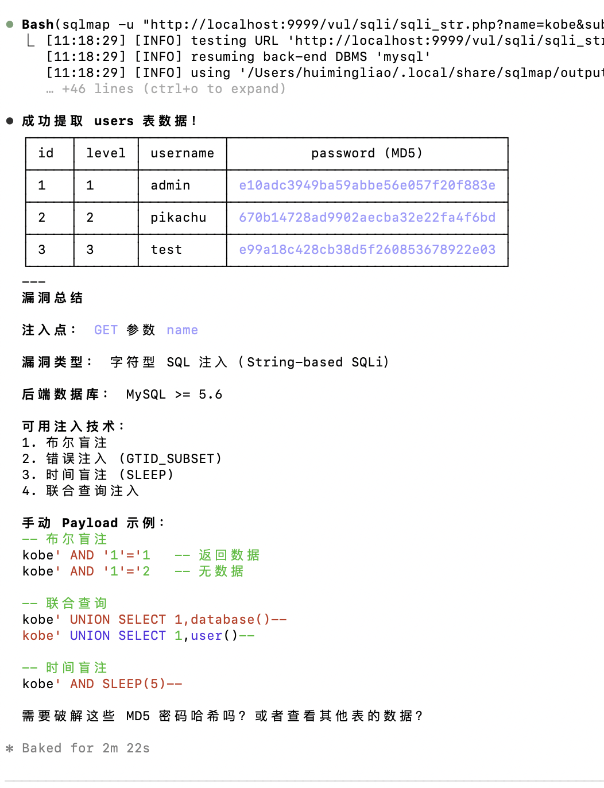

# Pentest-Skills

> 专为 AI CLI 工具（Claude Code / Gemini CLI）设计的模块化渗透测试技能集合。

[](LICENSE)

[English](README_EN.md) | 简体中文

---

## 项目概述

### 💡 核心理念

**告别复杂的命令行，用自然语言完成专业渗透测试。**

你只需描述测试目标，Claude Code 会自动选择合适的工具、执行命令、分析结果。

---

Pentest-Skills 为渗透测试工作流程提供原子级能力。每个技能包含：

- **知识文档** - 命令模板和工具使用指南
- **辅助脚本** - Python/Bash 自动化脚本
- **参考文档** - 全面的工具文档
- **资源文件** - 字典、载荷和资源

## 快速开始

### 1️⃣ 安装 Claude Code

在使用本项目的技能之前，你需要先安装 Claude Code 或其他 AI Coding 工具。
使用官方脚本安装
```bash
# macOS, Linux, WSL:
curl -fsSL https://claude.ai/install.sh | bash

# Windows PowerShell:
irm https://claude.ai/install.ps1 | iex

# Windows CMD:
curl -fsSL https://claude.ai/install.cmd -o install.cmd && install.cmd && del install.cmd
```
安装完成后,验证一下:
```bash
claude --version
```
如果显示版本号，说明安装成功!
**Claude Code 官方安装教程：** https://code.anthropic.com/docs

**Claude Code菜鸟安装入门教程：** https://www.runoob.com/claude-code/claude-code-install.html

**Skills入门教程：** https://www.runoob.com/claude-code/claude-agent-skills.html

### 2️⃣ 安装技能
```bash
# git clone 项目到本地
git clone https://github.com/crazyMarky/pentest-skills.git

# 进入项目目录
cd pentest-skills
```
将技能复制到你的 `.claude/skills/` 目录：

```bash
# 复制所有技能到 您项目下的.claude/skills/ 目录
cp -r * ~/.claude/skills/
```

重启你的 IDE 以加载技能。

### 3️⃣ 开始测试

打开 Claude Code，用自然语言描述你的测试需求：

```
你: 扫描 localhost 的开放端口，并分析服务版本
```
简单的自然语言描述，即可触发skills中的端口扫描技能，扫描结果会自动分析服务版本。


就这么简单！

---
```
你: 请帮我看看有没有sql注入：http://localhost:9999/vul/sqli/sqli_str.php?name=1&submit=%E6%9F%A5%E8%AF%A2
```

自动发现存在注入点，申请调用sqlmap进行注入测试。

成功拿到SQL注入

```
你：请帮我测试XSS，完整包如下：
GET //vul/xss/xss_01.php?message=111&submit=submit HTTP/1.1
  Host: localhost:9999
  sec-ch-ua: "Chromium";v="143", "Not A(Brand";v="24"
  sec-ch-ua-mobile: ?0
  sec-ch-ua-platform: "macOS"
  Accept-Language: zh-CN,zh;q=0.9
  Upgrade-Insecure-Requests: 1
  User-Agent: Mozilla/5.0 (Macintosh; Intel Mac OS X 10_15_7) AppleWebKit/537.36 (KHTML, like Gecko) Chrome/143.0.0.0 Safari/537.36
  Accept: text/html,application/xhtml+xml,application/xml;q=0.9,image/avif,image/webp,image/apng,*/*;q=0.8,application/signed-exchange;v=b3;q=0.7
  Sec-Fetch-Site: same-origin
  Sec-Fetch-Mode: navigate
  Sec-Fetch-User: ?1
  Sec-Fetch-Dest: document
  Referer: http://localhost:9999//vul/xss/xss_01.php?message=%3Cscript%3Ealert(1)%3C/script%3&submit=submit
  Accept-Encoding: gzip, deflate, br
  Cookie: PHPSESSID=sikaog4sgkb9eu15fjl44584td
  Connection: keep-alive
```
自动识别到过滤的机制，列举出哪些是有效的Payload

## 技能

### 信息收集 (侦察)

| 技能 | 描述 | 工具 |
|-------|-------------|-------|
| **recon-port-scan** | 端口扫描和服务识别 | nmap, masscan, rustscan |
| **recon-subdomain** | 子域名枚举和 DNS 侦察 | subfinder, amass, dnsx |
| **recon-dir-scan** | 目录和文件枚举 | ffuf, gobuster, feroxbuster |
| **recon-fingerprint** | Web 指纹识别和 WAF 检测 | wafw00f, whatweb, nuclei, httpx |

### 漏洞利用

| 技能 | 描述 | 工具 |
|-------|-------------|-------|
| **exploit-sqli** | SQL 注入检测和利用 | sqlmap, 手动注入技术 |
| **exploit-xss** | 跨站脚本检测 (反射型/存储型/DOM/盲注) | XSStrike, Dalfox, XSpear |
| **exploit-lfi** | 本地文件包含与目录遍历 | 路径遍历 payload, 日志注入 |
| **exploit-file-download** | 不安全文件下载与路径穿越 | 编码绕过, 敏感文件扫描 |

---


### ✨ 为什么选择 Claude Code + Pentest-Skills？

| 传统方式 | Claude Code 方式 |
|---------|-----------------|
| 需要记住大量工具和参数 | 用自然语言描述需求 |
| 手动组合多个工具 | AI 自动选择最优工具链 |
| 手动分析原始输出 | AI 自动生成分析报告 |
| 需要专业知识 | 降低使用门槛 |
| 耗时且易出错 | 快速且准确 |

**一句话总结：你发现问题，AI 完成工作。**

## 成果展示

### 端口扫描报告示例

```
╔═══════════════════════════════════════════════════════╗
║              Nmap 扫描结果分析报告                      ║
╠═══════════════════════════════════════════════════════╣
║ 目标: 192.168.1.100                                   ║
║ 扫描时间: 2025-02-07 12:30:45                         ║
║ 开放端口: 3                                            ║
╚═══════════════════════════════════════════════════════╝

PORT    STATE SERVICE  VERSION
22/tcp  open  ssh      OpenSSH 8.2p1 Ubuntu
80/tcp  open  http     nginx 1.18.0
443/tcp open  https    nginx 1.18.0

潜在风险:
  [!] SSH 可能在弱密码攻击下存在风险
  [!] HTTP 可升级到 HTTPS
  [!] 建议检查 SSL 证书配置
```

### 子域名发现报告示例

```
╔═══════════════════════════════════════════════════════╗
║            子域名枚举结果报告                          ║
╠═══════════════════════════════════════════════════════╣
║ 目标域名: example.com                                 ║
║ 发现时间: 2025-02-07 14:20:33                         ║
║ 总子域名: 1243                                         ║
╚═══════════════════════════════════════════════════════╝

高价值目标:
  ★ admin.example.com → 192.168.1.10 (管理后台)
  ★ api.example.com → 192.168.1.20 (API 接口)
  ★ dev.example.com → 192.168.1.30 (开发环境)

云服务识别:
  - AWS: 234 个子域名
  - Cloudflare: 456 个子域名
  - Azure: 89 个子域名
```

### 目录扫描报告示例

```
╔═══════════════════════════════════════════════════════╗
║            目录扫描结果报告                            ║
╠═══════════════════════════════════════════════════════╣
║ 目标: http://example.com                               ║
║ 扫描时间: 2025-02-07 16:45:12                         ║
║ 发现目录: 156                                           ║
╚═══════════════════════════════════════════════════════╝

高价值发现:
  [200] /admin           → 管理后台 (可能需要认证)
  [200] /api/v1          → API 接口文档
  [200] /uploads         → 文件上传目录
  [403] /.git            → Git 仓库泄露风险
  [403] /backup          → 备份目录 (可能包含敏感文件)

状态码分布:
  200: 23 个 (可访问)
  301: 45 个 (重定向)
  403: 67 个 (禁止访问 - 可能包含敏感信息)
  404: 14899 个 (不存在)

建议:
  [!] 检查 /.git 和 /.svn 是否存在源码泄露
  [!] /uploads 目录可能存在任意文件上传漏洞
  [!] /admin 建议使用强密码和双因素认证
```

## 技能结构

```
skill-name/
├── SKILL.md              # 核心文档（AI 触发器）
├── scripts/              # 辅助脚本
├── references/           # 详细文档
└── assets/               # 字典和资源
```

## 环境要求

每个技能都记录了其所需的工具。常见要求：

- **nmap** - 端口扫描
- **subfinder** - 子域名枚举
- **dnsx** - DNS 解析
- **ffuf** - 目录和文件模糊测试
- (可选) masscan, amass, rustscan, dirsearch, gobuster 等

### 安装工具

```bash
# 安装子域名枚举工具
go install -v github.com/projectdiscovery/subfinder/v2/cmd/subfinder@latest
go install -v github.com/projectdiscovery/dnsx/cmd/dnsx@latest

# 安装目录扫描工具
go install -v github.com/ffuf/ffuf/v2/cmd/ffuf@latest

# 安装端口扫描工具
# Ubuntu/Debian
sudo apt install nmap

# macOS
brew install nmap
```

## 常见问题

**Q: 这些工具安全吗？**
A: 所有脚本都是开源的，你可以自行审查代码。工具本身不包含任何恶意功能。

**Q: 可以用于生产环境吗？**
A: 仅用于授权的安全测试。未经授权的测试是违法的。

**Q: 如何保护自己的隐私？**
A: 使用时注意保护目标信息，不要在公开场合分享测试结果。

**Q: 必须使用 Claude Code 吗？**
A: 推荐使用 Claude Code 以获得最佳体验，但也支持其他兼容的 AI CLI 工具。

## 许可证

Apache License 2.0 - 详见 [LICENSE](LICENSE)。

## 贡献

欢迎贡献！请：

1. 遵循现有的技能结构
2. 包含全面的文档
3. 提交前测试脚本
4. SKILL.md 使用英语（AI 触发）

---

## ⚠️ 法律声明与免责条款

**本工具集仅用于合法授权的安全测试和教育目的。**

### 使用本工具前，你必须：

- [ ] 获得目标系统所有者的**书面授权**
- [ ] 遵守你所在国家/地区的所有法律法规
- [ ] 仅在合法的渗透测试、CTF 比赛、安全研究或授权测试中使用
- [ ] 对你的测试行为和后果负全部责任

### 严禁行为

- 未经授权扫描或攻击任何系统
- 对生产环境进行破坏性测试
- 用于任何非法目的或恶意活动

**重要提示**：未经授权的计算机系统访问可能违反《刑法》第285条、286条等相关法律，将面临刑事处罚。

---

**使用本工具即表示你同意以上条款。如果你不同意，请不要使用。**
[](https://star-history.com/#crazyMarky/pentest-skills&Date)